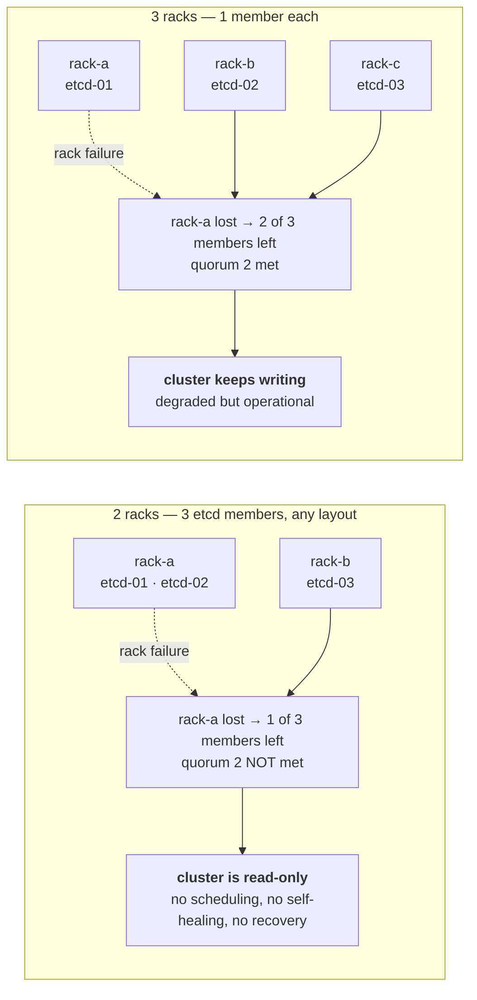
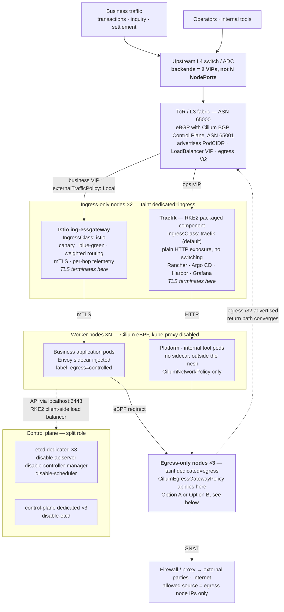
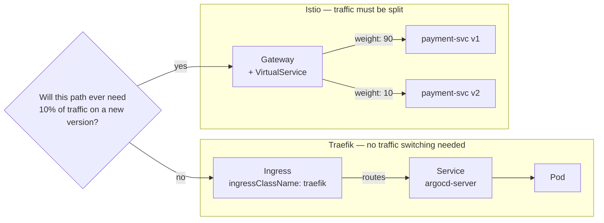
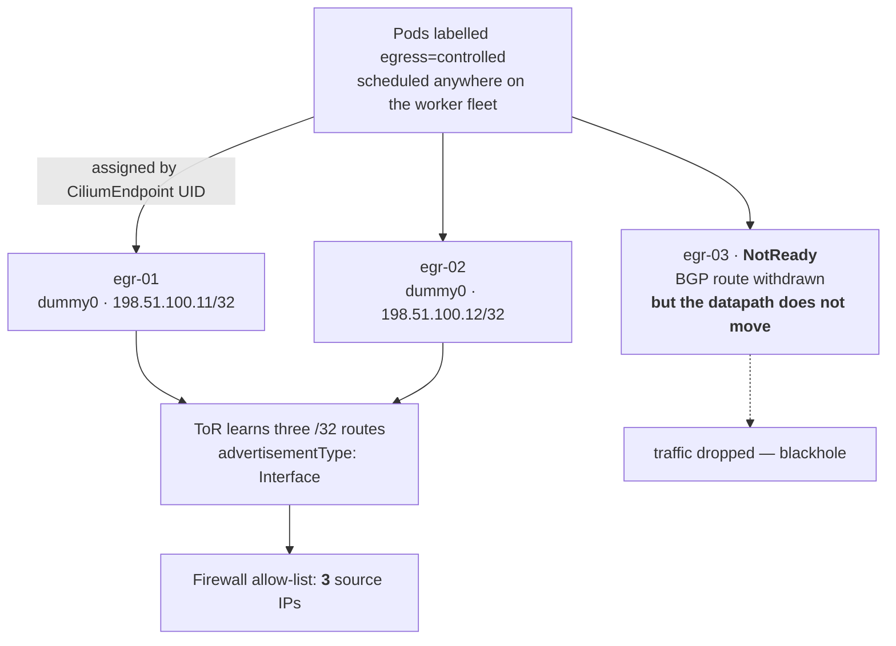
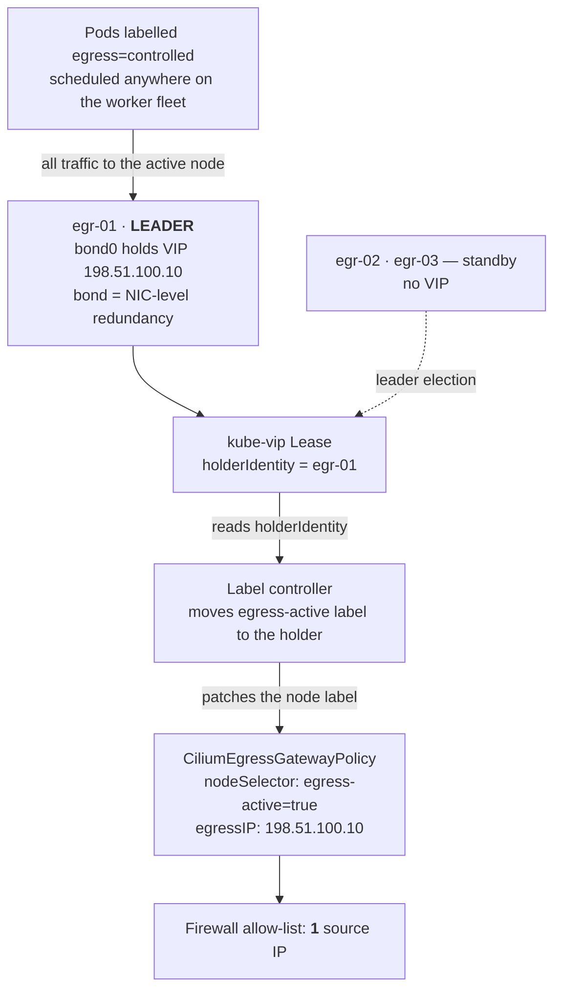

# On-Premises K8s Cluster Best Architecture

## 목차
1. [OverView](#overview)
2. [Design 정책 (Design Principles)](#design-principles)
3. [Environment](#environment)
4. [Architecture Diagram](#architecture-diagram)
5. [Architecture Kownledge Base](#architecture-kownledge-base)
6. [실측 필요 항목 (Items Requiring On-Site Measurement)](#실측-필요-항목-items-requiring-on-site-measurement)
7. [Contributing](#contributing)
8. [References](#references)

## OverView

해당 레포지토리는 온프레미스 환경에 적합한 K8s Cluster를 구성하기 위해 참고할 정보와, 솔루션 별 산재된 Best Practice를 모아 아키텍처로 설계한 내용을 작성하였습니다.
> **English :** This repository documents an architecture designed by collecting reference information and solution-specific best practices for building a K8s cluster suitable for on-premises environments.

Ansible 기반으로 코드화 하였으며, PR, Issue, Fork 모두 허용하며 수정요청또한 고마운 마음으로 받도록 하겠습니다.
> **English :** It is codified with Ansible. Pull requests, issues, and forks are all welcome, and suggestions for improvements are also greatly appreciated.

특히 아래 **Verified Facts** 섹션은 문서와 실제 구현이 어긋나는 지점을 소스 코드까지 확인해 정리한 것입니다. 틀린 부분이 있다면 Issue로 알려주시면 감사하겠습니다.
> **English :** In particular, the **Verified Facts** section below documents the points where official docs and actual implementation diverge, cross-checked against upstream source code. If anything here is wrong, please open an issue — corrections are the main thing this repository is asking for.

---

## Design 정책(Principles)
### **0. 물리 배치를 파악하고, 고 가용성에 사용한다.**

모든 솔루션의 고 가용성 확보를 위해, 실제 상면 Rack 별 Work Node 위치를 파악합니다.
공통 Rack에 모든 Ingress Traffic이 관리되거나, harbor와 같은 Image Registry가 위치할 경우 문제 발생 시 전체 장애로 이어질 수 있기 때문입니다.

어느 노드가 어느 렉에 있는지 파악하고, 라벨링 합니다. 이는 Affinity 정책에 사용됩니다.
> **English :** To ensure high availability across all solutions, we identify the physical rack location of each Work Node. 
>
> If all Ingress traffic is managed within a single shared rack, or if critical components such as Harbor are concentrated in the same rack, a failure in that rack could potentially lead to a system-wide outage.
>
>Therefore, we identify which rack each node is physically located in and apply appropriate labels to the nodes. These labels are then used to define Affinity and Anti-Affinity policies, ensuring that critical workloads are distributed across different racks and reducing the risk of a single point of failure.

### **1. 상단 L4의 backend를 노드 수와 분리한다.**
전 노드 NodePort를 타겟으로 잡으면 워커를 늘릴 때마다 L4 정책이 늘어납니다. LoadBalancer + LB IPAM + BGP 광고로 바꾸면 backend가 VIP 개수로 고정됩니다.
> **English :** Decouple the upstream L4 backend count from the node count. Targeting NodePorts on every node means L4 config grows every time you add a worker. Using `LoadBalancer` + Cilium LB IPAM + BGP advertisement pins the backend list to the number of VIPs instead.

### **2. 인그레스는 성격에 따라 나눈다.**
트래픽 스위칭이 필요한 경로에만 서비스 메시를 붙입니다. 사내 도구 30개에 사이드카를 붙이면 자원만 쓰고 얻는 것이 없습니다.
> **English :** Split ingress by workload character. Attach the service mesh only to paths that actually need traffic switching — putting a sidecar on thirty internal tools costs resources and buys nothing.

### **3. 역할 노드를 분리하고 테인트로 격리한다.**
etcd / control-plane / ingress / egress / worker를 나눕니다. etcd 분리의 근거는 쿼럼이 아니라 **장애 격리와 운영 표준화**입니다.
> **English :** Separate node roles and isolate them with taints — etcd / control-plane / ingress / egress / worker. Note that splitting etcd onto dedicated nodes does **not** change quorum arithmetic; the real justification is fault isolation and a single operational runbook across clusters.

### **4. Immutable OS의 전제를 코드가 지킨다.**
패키지 변경은 `transactional-update`로 모아서 한 번, 재기동도 한 번. 노드에서 직접 `sysctl`을 고치지 않습니다.
> **English :** Respect the immutable OS contract in code. Package changes go through a single `transactional-update` transaction and a single reboot; nothing is mutated on the node by hand.

---

## Environment

|구분(Category)|솔루션(Solution)|버전(Version)|비고(Notes)|
|--|--|--|--|
|OS|SUSE Linux Micro (SL Micro)|6.2|Immutable · `transactional-update` · btrfs snapshot|
|K8s|RKE2|v1.35.7+rke2r1|Kubernetes 1.35.7. RPM 설치 권장(RPM install recommended — see Verified Facts)|
|CNI|Cilium|1.19.x|kube-proxy replacement · BGP Control Plane v2 · Egress Gateway|
|Management|Rancher|v2.15.1|RKE2 v1.36 / v1.35 / v1.34 지원(supports)|
|Ingress (non-critical)|Traefik|v3.7.12 / chart 41.4.0|RKE2 패키지 컴포넌트(packaged component)|
|Ingress (business) · Mesh|Istio|1.31.0|k8s 1.32–1.36 지원(supported)|
|Egress HA|kube-vip|v1.2.3|Option B 전용(Option B only)|
|CI|Jenkins (LTS)|2.568.3|Tekton v1.15.1 LTS 도 대안(alternative)|
|CD|Argo CD|v3.5.2|`selfHeal` 기본 비활성(disabled by default — change control)|
|Registry|Harbor|v2.15.2 / chart 1.19.2|폐쇄망 미러 · OCI 차트 저장소(air-gapped mirror + OCI chart repo)|
|Authentication / Authorization|Keycloak|26.7.3|OIDC → Rancher · Argo CD · Grafana|
|Policy|Kyverno|v1.19.0 / chart 3.9.0|OpenShift SCC 대체(SCC replacement)|
|Runtime Security|NeuVector|v5.6.1 / chart 2.11.1|프로세스·파일 무결성, 이미지 CVE|
|Secrets|HashiCorp Vault|v2.1.0|+ External Secrets Operator v2.10.0|
|Certificates|cert-manager|v1.21.1|Ingress TLS|
|Monitoring (metrics)|Prometheus|v3.14.0 (LTS 3.13.0)|chart `kube-prometheus-stack` 89.2.2|
|Visualization|Grafana|13.2.1|Keycloak OIDC 연동|
|Logging|Grafana Loki|v3.7.7|chart 6.51.x|
|Backup|Velero|v1.18.2 / chart 12.1.0|etcd 스냅샷으로 못 하는 네임스페이스·PV 단위 복구|

버전은 2026-09-06 기준 각 프로젝트의 최신 안정 릴리스입니다. 사전 릴리스(RC)는 포함하지 않았습니다.
> **English :** Versions are the latest stable releases as of 2026-09-06. No pre-releases (RCs) are included.

> **Note on the original draft table :** 초안에서 Monitoring을 Grafana, Logging을 Prometheus로 적었는데 이는 뒤바뀐 표기입니다. Prometheus는 메트릭 수집, Grafana는 시각화, 로그는 Loki(또는 OpenSearch)가 담당합니다.
> An earlier draft listed Grafana under *Monitoring* and Prometheus under *Logging*. That is inverted — Prometheus collects metrics, Grafana visualizes, and Loki (or OpenSearch) handles logs.

---
## Architecture Diagram

    2026_09_06 In progress...

---


## Architecture Kownledge Base

### 0. Overall — 물리적 Rack 위치 구성

모든 솔루션의 고가용성은 **물리 배치가 뒷받침될 때만** 성립합니다. 파드를 3개로 늘려도 세 개가 같은 랙에 있으면 실질 복제본은 1개입니다.
> **English :** High availability only holds if the physical placement backs it up. Three replicas that all live in one rack are, in failure terms, one replica.

공통 랙에 모든 인그레스 트래픽이 몰리거나 이미지 레지스트리가 위치하면 그 랙의 문제가 전체 장애로 이어집니다.
> **English :** If all ingress traffic funnels through one rack, or the image registry sits in one rack, a problem in that rack becomes a cluster-wide outage.

### The number that decides everything — etcd quorum vs rack count

N 멤버 etcd의 쿼럼은 `floor(N/2)+1` 입니다. 따라서 **한 랙에 놓을 수 있는 최대 멤버 수는 `N - quorum`** 입니다.
> **English :** Quorum for an N-member etcd cluster is `floor(N/2)+1`. Therefore the maximum members you may place in a single rack is `N - quorum`.

|etcd 멤버(members)|쿼럼(quorum)|랙당 최대(max per rack)|필요 최소 랙 수(min racks)|가능한 배치(valid layout)|
|--|--|--|--|--|
|3|2|1|**3**|1 / 1 / 1|
|5|3|2|**3**|2 / 2 / 1|
|7|4|3|**3**|3 / 3 / 1|

즉 **홀수 etcd 구성에서 랙 2개로는 어떤 배치를 해도 랙 하나를 잃으면 쿼럼이 깨집니다.** 멤버 수를 늘려도 해결되지 않습니다.
> **English :** With an odd-sized etcd cluster, **no placement across only two racks survives the loss of a rack.** Adding more members does not fix it — three failure domains is the floor, always.



랙이 2개뿐이라면 선택지는 둘입니다. ①랙 장애를 스냅샷 복원 이벤트로 감수하고 SLA에 명시한다 ②세 번째 장애 도메인을 만든다.
> **English :** With only two racks you either accept rack loss as a restore-from-snapshot event and say so in the SLA, or you create a third failure domain.

### A different rack is not always a different failure domain

랙이 달라도 아래가 같으면 같은 장애 도메인입니다.
> **English :** Different racks are not different failure domains if they share any of the following:

- **전원 계통(PDU)** — 랙 2개가 같은 PDU를 물고 있으면 도메인은 1개 / a shared PDU collapses two racks into one domain
- **ToR 스위치 쌍** — 랙 간 연결이 단일 스위치를 경유하면 그 스위치가 SPOF / a single ToR in the path is the SPOF
- **상단 업링크** — 두 ToR이 같은 코어 1대로만 올라가면 마찬가지 / same for a single core uplink
- **냉방 구역** — 같은 항온항습 구역은 함께 죽습니다 / a shared cooling zone fails together

이 저장소는 `pdu`를 인벤토리에 따로 받고, etcd의 PDU가 1계통이면 경고합니다.
> **English :** This repository takes `pdu` as a separate inventory field and warns when all etcd members share one power feed.

### What must never sit in a single rack

|구성요소(Component)|한 랙에 몰렸을 때의 결과(Consequence of single-rack placement)|
|--|--|
|**etcd**|쿼럼 손실 → **클러스터 전체가 읽기 전용**. 가장 치명적<br>Quorum loss → **the entire cluster goes read-only.** The worst case|
|**인그레스 노드**|클러스터는 살아 있는데 **외부에서 들어올 수 없음**<br>The cluster is healthy but **unreachable from outside**|
|**이그레스 노드**|대외 연동 전면 중단<br>All outbound integration stops|
|**이미지 레지스트리**|신규 파드 기동 불가. 기존 파드는 살아 있어 **장애가 늦게 발견됨**<br>No new pods can start; running pods stay up, so **the failure is discovered late**|
|**control-plane**|API 불가 → 스케줄·복구 작업 자체가 불가능<br>No API → you cannot even perform the recovery|
|**스토리지 복제본**|복제본 3개가 한 랙 → 실질 복제본 1개<br>Three replicas in one rack is one replica|

### From "identified" to "enforced"

파악에서 끝내면 위키 문서가 됩니다. 이 저장소는 4단계로 강제합니다.
**코드화 이후 추가 예정입니다.**
> **English :** Identification alone produces a wiki page. This repository enforces it in four steps.

1. 인벤토리에 노드별 `rack` / `pdu`를 적습니다 / record `rack` and `pdu` per node in the inventory
2. `preflight`가 착수 전에 배치를 **검증하고 실패시킵니다** / `preflight` validates the layout and **fails the run**
3. `node_labels`가 랙을 `topology.kubernetes.io/zone` 라벨로 승격합니다 / `node_labels` promotes the rack to the well-known zone label
4. 인그레스 차트가 그 라벨로 `topologySpreadConstraints`를 겁니다 / the ingress charts spread on that label

```yaml
# inventories/prod/hosts.yml
k8s-etcd-01: {node_ip: 10.10.10.11, rack: rack-a, pdu: pdu-a}
k8s-etcd-02: {node_ip: 10.10.10.12, rack: rack-b, pdu: pdu-b}
k8s-etcd-03: {node_ip: 10.10.10.13, rack: rack-c, pdu: pdu-a}
```

```bash
ansible-playbook playbooks/00-preflight.yml --tags topology
```

배치가 잘못되어 있으면 **구축이 시작되지 않습니다.**
> **English :** A wrong layout stops the build before it starts.

```
etcd 3멤버(쿼럼 2)에서 한 랙에 최대 1개까지만 놓을 수 있는데
실제로는 2개가 한 랙에 있습니다. 현재 배치: {'rack-a': 2, 'rack-b': 1}
→ 그 랙을 잃으면 클러스터 전체가 읽기 전용이 됩니다.
```

### Why `topology.kubernetes.io/zone`, and why `ScheduleAnyway`

랙 전용 커스텀 라벨만 쓰면 스케줄러는 인식하지만 **CSI 볼륨 토폴로지와 일부 차트의 기본 spread 설정은 인식하지 못합니다.** 온프레미스 단일 DC에서는 랙을 `zone`으로 매핑하는 것이 호환성이 가장 좋습니다. 이 저장소는 두 라벨을 모두 붙입니다.
> **English :** A custom rack-only label is invisible to CSI volume topology and to the spread defaults baked into several charts. In a single-DC on-prem environment, mapping rack → `zone` is the pragmatic choice; this repository applies both labels.

`whenUnsatisfiable: DoNotSchedule`은 분산을 강제하지만 **랙 하나가 죽었을 때 남은 랙으로 재스케줄되는 것도 막습니다.** 장애 상황에서 파드가 Pending으로 남는 쪽이 더 나쁜 경우가 많아 기본값은 `ScheduleAnyway`입니다.
> **English :** `DoNotSchedule` enforces the spread but also blocks rescheduling onto the surviving racks when a rack dies. Pods stuck in `Pending` during an outage is usually the worse failure mode, so the default here is `ScheduleAnyway`.

### Stateful components need more than spreading

Harbor를 예로 들면, 파드를 랙에 흩뿌리는 것만으로는 HA가 되지 않습니다. Harbor의 실제 상태는 PostgreSQL · Redis · 오브젝트 스토리지에 있습니다. 이 둘 또한 PG는 CloudNativePG, Redis Sentinel 구성으로 완전한 HA를 확보해야 합니다.
> **English :** Simply spreading Harbor pods across different racks does not make Harbor highly available.
>
>Harbor's actual state resides in PostgreSQL, Redis, and object storage. These components must also be designed for high availability. For example, PostgreSQL can be deployed using CloudNativePG, while Redis can be configured with Redis Sentinel to eliminate single points of failure.
>
>If you use Harbor's bundled PostgreSQL and Redis without additional HA configuration, they can become single points of failure (SPOF).

### 1. Overall — from the upstream L4 down to external egress

남북 트래픽은 상단 L4의 VIP 2개에서 갈라져 인그레스 전용 노드로 들어가고, 외부로 나가는 트래픽은 워커 노드에서 eBPF로 가로채여 이그레스 전용 노드에서 SNAT됩니다.
> **English :** North-south traffic splits at two VIPs on the upstream L4 and lands on ingress-only nodes. Outbound traffic is intercepted by eBPF on the worker nodes and SNATed on egress-only nodes.



### 2. Ingress — Traefik and Istio side by side

두 IngressClass를 병행합니다. 같은 일을 두 번 하는 것이 아니라, 성격이 다른 트래픽을 다른 계층에서 처리하는 것입니다.
> **English :** Two IngressClasses run in parallel. This is not the same job done twice — it is two different kinds of traffic handled at the layer each one actually needs.



|구분(Category)|Traefik (`traefik`)|Istio (`istio`)|
|--|--|--|
|대상(Target)|사내 콘솔·오픈소스 도구·단순 HTTP 노출<br>Internal consoles, OSS tools, plain HTTP|업무 애플리케이션<br>Business applications|
|예시(Examples)|Rancher, Argo CD, Harbor, Grafana, Hubble UI|결제·조회·정산 서비스<br>Payment, inquiry, settlement services|
|트래픽 스위칭(Traffic switching)|불필요(not needed)|**카나리·블루그린·가중치(canary / blue-green / weighted)**|
|서비스 간 암호화(Service-to-service encryption)|불필요(not needed)|**mTLS (STRICT)**|
|사이드카(Sidecar)|없음(none)|Envoy injected|
|자원 부담(Resource cost)|낮음(low)|파드당 req 50m / 128Mi per pod|
|장애 반경(Blast radius)|도구 계층에 한정(tooling only)|업무 전체(entire business surface)|

판단 기준은, **"이 경로에 10%만 신 버전을 태워야 할 일이 생기는가?"** 로 두었습니다. 생긴다면 Istio, 아니면 Traefik.
Traffic 관리가 필요한경우만 Istio를 태웁니다.
> **English :** The decision rule is one sentence — *"will this path ever need 10% of traffic on a new version?"* If yes, Istio. If no, Traefik.

#### Istio mTLS breaks L7 DPI

Istio mTLS를 켜면 파드 간 트래픽이 암호화되어 NeuVector의 L7 DPI가 내용을 보지 못합니다. 두 제품이 같은 L7 정책을 한다고 설명하면 정책 소재지가 모호해집니다.
> **English :** Enabling Istio mTLS encrypts pod-to-pod traffic, which blinds NeuVector's L7 deep packet inspection. If you present both products as doing "L7 policy", you can no longer answer where a given policy actually lives.

역할을 이렇게 나눕니다.
> **English :** Divide the responsibilities like this:

- **Istio** — 메시 내부의 L7 라우팅·인가·텔레메트리 / L7 routing, authorization and telemetry inside the mesh
- **NeuVector** — 런타임 프로세스·파일 무결성, 이미지 취약점, 메시 밖 워크로드 / runtime process & file integrity, image CVEs, workloads outside the mesh
- **Cilium** — L3/L4 네트워크 정책과 이그레스 통제 / L3–L4 network policy and egress control

---

## Egress — two options, and why there are two

노드 10대 중 3대로만 외부 통신을 내보내고 방화벽에 등록할 출발지 IP를 고정하려 합니다. 임의의 노드에서 뜬 파드의 트래픽을 특정 노드로 보내는 기능은 **Cilium에서 egress gateway 하나뿐**입니다.
> **English :** The goal is to send outbound traffic through only 3 of 10 nodes and pin the source IP registered on the firewall. In Cilium, **egress gateway is the only mechanism** that redirects traffic from a pod on an arbitrary node to a specific node.

"egress 전용 노드 대역을 따로 둔다"는 접근은 **파드 스케줄링을 그 노드에 묶을 때만** 성립합니다. 워크로드를 전 노드에 분산하면서 출구만 모으려면 egress gateway가 필요합니다.
> **English :** The idea of "just put the egress nodes on their own subnet" only holds if you also pin pod scheduling to those nodes. If workloads stay spread across the fleet while only the exit is consolidated, you need the egress gateway.

### Option A — Cilium eBGP, per-node fixed IP

각 egress 노드가 `dummy0`에 자기 /32를 들고 있고, Cilium BGP가 그 주소를 `advertisementType: Interface`로 ToR에 광고합니다. **이 광고 타입은 Cilium 1.19에서 새로 생긴 기능입니다.**
> **English :** Each egress node holds its own /32 on `dummy0`, and Cilium BGP advertises that address to the ToR using `advertisementType: Interface`. **This advertisement type is new in Cilium 1.19.**



- **해결하는 것 / Solves :** 리턴 경로, IP 이동성, 출발지 IP 고정, 용량 분산 / return path, IP mobility, fixed source IPs, capacity distribution
- **해결하지 못하는 것 / Does not solve :** 노드 장애 시 페일오버 / failover on node failure

Cilium은 노드의 `NotReady`·cordon·drain을 보지 않습니다. 게이트웨이 노드가 죽어도 정책은 그 노드를 계속 가리키고, 배정된 파드의 트래픽은 블랙홀됩니다. BGP 경로는 철회되지만 데이터패스는 그대로입니다.
> **English :** Cilium does not observe `NotReady`, cordon, or drain. When a gateway node dies the policy keeps pointing at it and traffic from the pods assigned to it blackholes. The BGP route is withdrawn, but the datapath does not move.

### Option B — kube-vip NIC HA, single VIP



**왜 kube-vip만으로는 안 되는가 / Why kube-vip alone is not enough**

Cilium은 `nodeSelector`로 **노드를 먼저 고른 다음** 그 노드에서 `egressIP`를 찾습니다. VIP가 어디 붙어 있는지는 추적하지 않습니다. kube-vip만 넣으면 리더가 넘어가도 정책은 죽은 노드를 계속 가리킵니다. **라벨을 함께 옮기는 주체가 반드시 있어야 합니다.**
> **English :** Cilium selects the **node first** via `nodeSelector`, and only then looks for `egressIP` on that node. It does not track where the VIP currently lives. With kube-vip alone, the policy keeps pointing at the dead node even after the leader moves. **Something has to move the label along with the VIP.**

이 저장소는 그 컨트롤러를 `kubectl` 기반 Deployment로 제공합니다. 커스텀 바이너리를 만들지 않았으므로 폐쇄망 반입 이미지가 1개로 끝납니다.
> **English :** This repository ships that controller as a plain `kubectl`-based Deployment. No custom binary means exactly one image to bring into an air-gapped environment.

**NIC 이중화 / NIC redundancy :** `vip_interface`를 본딩 인터페이스(`bond0`, 802.3ad)로 두어야 NIC 한 장이 죽어도 VIP가 유지됩니다.
> **English :** `vip_interface` must point at a bonded interface (`bond0`, 802.3ad) so that the VIP survives the loss of a single NIC.

**한계 / Limitations**

- **active-standby입니다.** VIP 하나로 active-active는 불가능합니다 — SNAT conntrack이 두 노드에 나뉘면 리턴 트래픽이 어긋납니다.
  > It is active-standby. A single VIP cannot do active-active: split SNAT conntrack across two nodes breaks the return path.
- **전환 시 기존 연결은 끊깁니다.** Cilium은 게이트웨이 변경 시 conntrack을 유지하지 않습니다 ([cilium#39245](https://github.com/cilium/cilium/discussions/39245)).
  > Existing connections break on switchover. Cilium does not preserve conntrack across a gateway change.
- 총 단절 시간 = 리스 만료 + 라벨 반영(폴링 주기) + Cilium 재수렴. **실측하십시오.**
  > Total outage = lease expiry + label propagation (polling interval) + Cilium reconvergence. **Measure it.**

### Comparison

|구분(Category)|egress GW 단독<br>(GW alone)|Option A<br>(eBGP)|Option B<br>(kube-vip)|방화벽 SNAT<br>(firewall SNAT)|
|--|--|--|--|--|
|출발지 IP 고정(Fixed source IP)|O|O (3)|O (1)|O|
|리턴 경로(Return path)|정적 경로 필요<br>static routes|**자동 수렴 (BGP)**<br>**converges automatically**|ARP / L2|N/A|
|용량 분산(Load distribution)|X|**O**|X|O|
|노드 장애 대응(Node failure)|X|X|전환 O, 무중단 X<br>fails over, not seamless|O|
|추가 컴포넌트(Extra components)|없음(none)|없음(none)|kube-vip + controller|없음(none)|
|파드 단위 통제(Per-pod control)|O|O|O|**X**|

**권고 / Recommendation**

- 파드 단위로 출구를 통제해야 한다면 **Option A를 기본**으로 하고 방화벽에 IP 3개를 등록하십시오.
  > If you need per-pod egress control, take **Option A** as the default and register three source IPs on the firewall.
- 출발지 IP가 반드시 1개여야 한다면 **Option B**를 쓰되, active-standby이고 전환 시 단절이 있다는 점을 운영 문서에 명시하십시오.
  > If the source IP must be exactly one, use **Option B**, and state plainly in your runbook that it is active-standby with a switchover gap.
- 파드 단위 구분 자체가 필요 없다면 egress gateway를 쓰지 말고 상단 방화벽의 SNAT을 그대로 쓰는 것이 가장 안정적입니다.
  > If you do not need per-pod distinction at all, do not use the egress gateway — the upstream firewall's own SNAT is the most stable answer.

---

## Verified Facts

문서와 실제 구현이 어긋나는 지점들입니다. 각 항목은 상위 프로젝트의 문서 또는 소스 코드에서 확인했습니다.
> **English :** Points where documentation and actual behaviour diverge. Each item was checked against upstream documentation or source code.

|항목(Item)|확인된 사실(Verified fact)|설계 반영(Applied as)|
|--|--|--|
|RKE2 v1.35 default ingress|여전히 `ingress-nginx`. Traefik이 기본이 되는 것은 v1.36, nginx 제거는 v1.37<br>Still `ingress-nginx`. Traefik becomes the default in v1.36; nginx is removed in v1.37|`ingress-controller: traefik` 명시<br>set explicitly|
|ingress-nginx EOL|2026-03 은퇴. 후속으로 계획됐던 InGate 프로젝트도 취소됨<br>Retired 2026-03. The planned successor, InGate, was also cancelled|Traefik 표준화<br>standardize on Traefik|
|Cilium 1.19 BGPv1|`CiliumBGPPeeringPolicy` **제거됨**<br>**removed**|`cilium.io/v2` 4종 CRD<br>the four v2 CRDs|
|Cilium 1.19 new|`advertisementType: Interface` — 로컬 인터페이스의 임의 IP를 /32로 광고<br>advertises arbitrary IPs on a local interface as /32|Option A의 핵심 메커니즘<br>the core mechanism of Option A|
|Egress GW failover|**없음.** 게이트웨이 선택 로직에 readiness·taint·unschedulable 검사가 없음 ([#18230](https://github.com/cilium/cilium/issues/18230), open)<br>**None.** The gateway selection path contains no readiness, taint, or unschedulable check|Option B에 라벨 컨트롤러 필수<br>label controller is mandatory in Option B|
|`egressGateways` list (1.18+)|부하 분산이지 페일오버가 아님. 파드는 CiliumEndpoint UID로 배정되고, 노드가 NotReady여도 목록은 그대로<br>Load distribution, not failover. Pods are assigned by CiliumEndpoint UID and the list is unchanged when a node goes NotReady|Option A의 한계로 명시<br>documented as Option A's limit|
|Egress GW and MTU|켜면 라우팅 모드와 무관하게 터널 디바이스가 생성되어 파드 MTU가 내려감<br>Enabling it creates a tunnel device regardless of routing mode, lowering pod MTU|`MTU` 고정 후 실측<br>pin `MTU`, then measure|
|Egress GW prerequisites|`bpf.masquerade` · `kubeProxyReplacement` · identity `crd` · CiliumEndpointSlice 비활성. 하나라도 어긋나면 에이전트가 기동 자체를 거부<br>If any of these is wrong the agent refuses to start|Helm 값에 고정<br>pinned in Helm values|
|`egressIP` format|단일 IPv4만. CIDR 불가. `interface`와 동시 지정 시 정책 전체가 **조용히 무시됨**<br>Single IPv4 only, no CIDR. Setting it together with `interface` makes the policy **silently ignored**|둘 중 하나만 사용<br>use exactly one|
|SNAT connection limit|`{egressIP, dst IP, dst port}` 당 약 32,768<br>~32,768 per tuple|검증 항목에 포함<br>added to the verification checklist|
|RKE2 + Cilium API access|`k8sServiceHost: localhost` — agent가 127.0.0.1:6443에 클라이언트 사이드 LB를 띄움<br>the RKE2 agent runs a client-side load balancer on 127.0.0.1:6443|단일 서버 주소를 박지 않음<br>never hardcode one server address|
|RKE2 secrets encryption|FIPS는 `aescbc` 한정. `secretbox`는 불가<br>FIPS applies to `aescbc` only, not `secretbox`|`aescbc` 고정|
|etcd encryption key|복호화 키가 같은 노드에 평문으로 존재<br>The decryption key sits in plaintext on the same node|Vault를 2계층으로 병행<br>Vault added as a second tier|
|CIS profile value|v1.29+ 는 `cis` (버전 표기 없음)<br>plain `cis` since v1.29|`profile: cis`|
|SL Micro install method|`install.sh`는 tarball 기본 → `/usr/local` 또는 `/opt/rke2`, **OS 스냅샷 밖**. RPM은 `INSTALL_RKE2_METHOD=rpm`<br>tarball is the default and lands **outside** the OS snapshot|RPM 강제 (롤백 일관성)<br>force RPM for rollback consistency|
|Traefik chart 41.x|`service.type` 키 **삭제됨** → `service.spec.type`. 구 표기는 무시되고 ClusterIP로 뜸<br>`service.type` is **gone**; the old key is silently ignored and you get a ClusterIP|신 표기 사용<br>use the new key|
|Split-role etcd|쿼럼 수식은 동일. 분리 근거는 장애 격리와 운영 표준화<br>Quorum arithmetic is unchanged; the justification is fault isolation and runbook uniformity|근거를 문서에 명시<br>stated explicitly|

---

## 실측 필요 항목 (Items Requiring On-Site Measurement)

1. **파드 MTU** — `kubectl exec <pod> -- ping -M do -s 1422 <external IP>`
   egress gateway 활성 시 터널이 생기므로 이론값과 다를 수 있습니다.
   > Pod MTU. A tunnel appears once the egress gateway is enabled, so the effective value may differ from the calculated one.
2. **이그레스 노드 장애 시 동작** — 게이트웨이 노드를 `NotReady`로 만들고 관찰하십시오. **Option A는 끊기는 것이 정상 동작입니다.**
   > Behaviour on egress node failure. Force a gateway node to `NotReady` and watch. For Option A, traffic stopping *is* the expected behaviour.
3. **Option B의 전환 총 단절 시간** — 리스 만료 + 라벨 반영 + Cilium 재수렴.
   > Total switchover gap for Option B.
4. **BGP 수렴 시간** — 노드 재기동 시 경로 광고/철회에 걸리는 시간.
   > BGP convergence time on node reboot.
5. **cilium-agent 재시작 영향** — `kubeProxyReplacement` + socketLB + hostFirewall 조합에서 호스트 egress가 수 분간 끊긴 사례가 보고되어 있습니다 ([#45077](https://github.com/cilium/cilium/issues/45077), closed as not planned). **롤링 업그레이드 전에 반드시 확인하십시오.**
   > Impact of a cilium-agent restart. Multi-minute host egress outages have been reported for the `kubeProxyReplacement` + socketLB + hostFirewall combination. Verify this before any rolling upgrade.
6. **NeuVector L7 DPI 지연** — Istio mTLS 구간 밖에서만 유효한 측정입니다.
   > NeuVector L7 DPI latency — only measurable outside the Istio mTLS path.

---

## Contributing

이 저장소는 **틀린 부분을 지적받는 것**을 목적으로 공개합니다. 특히 다음 항목에 대한 반론을 환영합니다.
> **English :** This repository is published specifically to have its mistakes pointed out. Pushback on the following is especially welcome.

- Verified Facts 표의 각 항목 — 버전이 올라가면서 사실이 바뀐 것이 있는지
  > Each row of the Verified Facts table — anything that has changed with a newer release
- Egress Option A / B 외에 더 나은 접근이 있는지 (예: 노드 밖 프록시 계층, MetalLB + 별도 SNAT)
  > Better approaches than Options A and B — an off-cluster proxy tier, MetalLB with separate SNAT, and so on
- Traefik / Istio 이원화가 과설계인지, 아니면 더 나눠야 하는지
  > Whether the Traefik/Istio split is over-engineering, or should be split further
- Immutable OS 위에서 RPM vs tarball 선택의 실제 운영 경험
  > Real operational experience with RPM vs tarball on an immutable OS

PR, Issue, Fork 모두 환영합니다.
> **English :** PRs, issues and forks are all welcome.

---

## References

- [Cilium — Egress Gateway](https://docs.cilium.io/en/stable/network/egress-gateway/egress-gateway/)
- [Cilium — BGP Control Plane](https://docs.cilium.io/en/stable/network/bgp-control-plane/bgp-control-plane/)
- [Cilium — Kubernetes without kube-proxy](https://docs.cilium.io/en/stable/network/kubernetes/kubeproxy-free/)
- [cilium#18230 — Egress gateway does not tolerate single node failure](https://github.com/cilium/cilium/issues/18230)
- [cilium#39245 — Maintain existing connections when modifying egress gateways](https://github.com/cilium/cilium/discussions/39245)
- [cilium#45077 — Host loses egress connectivity on agent restart](https://github.com/cilium/cilium/issues/45077)
- [RKE2 — Ingress migration](https://docs.rke2.io/reference/ingress_migration)
- [RKE2 — Server roles](https://docs.rke2.io/install/server_roles)
- [RKE2 — Network options](https://docs.rke2.io/networking/basic_network_options)
- [RKE2 — Hardening guide](https://docs.rke2.io/security/hardening_guide)
- [RKE2 — Secrets encryption](https://docs.rke2.io/security/secrets_encryption)
- [Kubernetes — Ingress NGINX retirement](https://www.kubernetes.dev/blog/2025/11/12/ingress-nginx-retirement/)
- [Istio — Supported releases](https://istio.io/latest/docs/releases/supported-releases/)
- [traefik-helm-chart](https://github.com/traefik/traefik-helm-chart)
- [kube-vip](https://kube-vip.io/)

---

## License

Apache-2.0