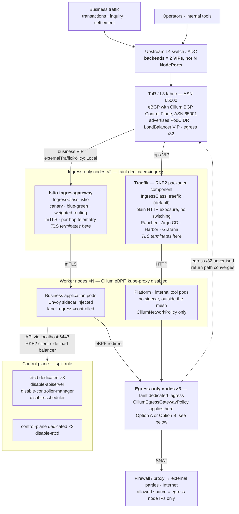
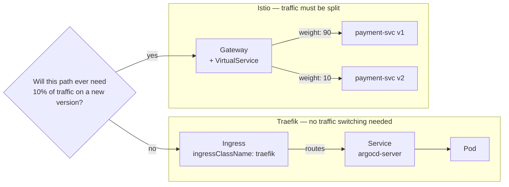
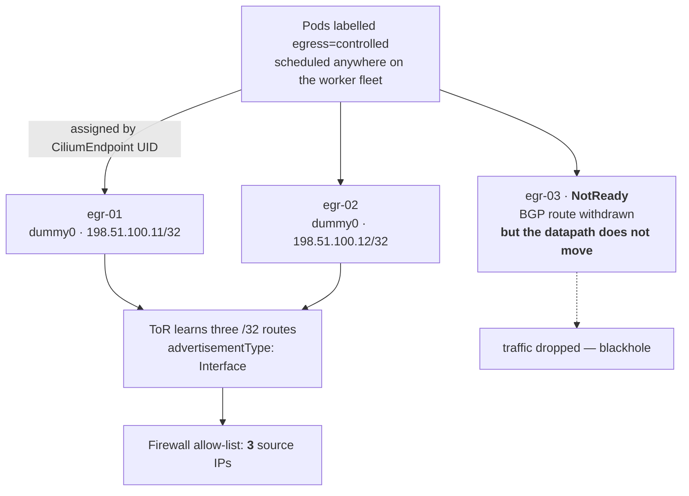
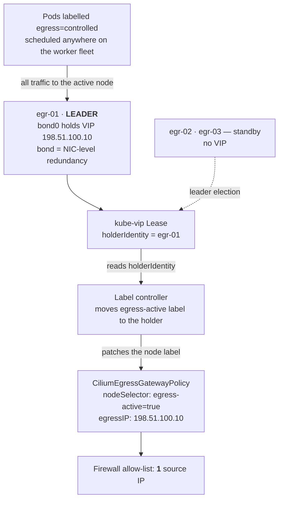

# 1. Overall — from the upstream L4 down to external egress

남북 트래픽은 상단 L4의 VIP 2개에서 갈라져 인그레스 전용 노드로 들어가고, 외부로 나가는 트래픽은 워커 노드에서 eBPF로 가로채여 이그레스 전용 노드에서 SNAT됩니다.
> **English :** North-south traffic splits at two VIPs on the upstream L4 and lands on ingress-only nodes. Outbound traffic is intercepted by eBPF on the worker nodes and SNATed on egress-only nodes.

# 2. Ingress — Traefik and Istio side by side

두 IngressClass를 병행합니다. 같은 일을 두 번 하는 것이 아니라, 성격이 다른 트래픽을 다른 계층에서 처리하는 것입니다.
> **English :** Two IngressClasses run in parallel. This is not the same job done twice — it is two different kinds of traffic handled at the layer each one actually needs.

|구분(Category)|Traefik (`traefik`)|Istio (`istio`)|
|--|--|--|
|대상(Target)|사내 콘솔·오픈소스 도구·단순 HTTP 노출 Internal consoles, OSS tools, plain HTTP|업무 애플리케이션 Business applications|
|예시(Examples)|Rancher, Argo CD, Harbor, Grafana, Hubble UI|결제·조회·정산 서비스 Payment, inquiry, settlement services|
|트래픽 스위칭(Traffic switching)|불필요(not needed)|**카나리·블루그린·가중치(canary / blue-green / weighted)**|
|서비스 간 암호화(Service-to-service encryption)|불필요(not needed)|**mTLS (STRICT)**|
|사이드카(Sidecar)|없음(none)|Envoy injected|
|자원 부담(Resource cost)|낮음(low)|파드당 req 50m / 128Mi per pod|
|장애 반경(Blast radius)|도구 계층에 한정(tooling only)|업무 전체(entire business surface)|

판단 기준은, **"이 경로에 10%만 신 버전을 태워야 할 일이 생기는가?"** 로 두었습니다. 생긴다면 Istio, 아니면 Traefik.
Traffic 관리가 필요한경우만 Istio를 태웁니다.
> **English :** The decision rule is one sentence — *"will this path ever need 10% of traffic on a new version?"* If yes, Istio. If no, Traefik.

#### Istio mTLS breaks L7 DPI

Istio mTLS를 켜면 파드 간 트래픽이 암호화되어 NeuVector의 L7 DPI가 내용을 보지 못합니다. 두 제품이 같은 L7 정책을 한다고 설명하면 정책 소재지가 모호해집니다.
> **English :** Enabling Istio mTLS encrypts pod-to-pod traffic, which blinds NeuVector's L7 deep packet inspection. If you present both products as doing "L7 policy", you can no longer answer where a given policy actually lives.

역할을 이렇게 나눕니다.
> **English :** Divide the responsibilities like this:

- **Istio** — 메시 내부의 L7 라우팅·인가·텔레메트리 / L7 routing, authorization and telemetry inside the mesh
- **NeuVector** — 런타임 프로세스·파일 무결성, 이미지 취약점, 메시 밖 워크로드 / runtime process & file integrity, image CVEs, workloads outside the mesh
- **Cilium** — L3/L4 네트워크 정책과 이그레스 통제 / L3–L4 network policy and egress control

---

## Egress — two options, and why there are two

노드 10대 중 3대로만 외부 통신을 내보내고 방화벽에 등록할 출발지 IP를 고정하려 합니다. 임의의 노드에서 뜬 파드의 트래픽을 특정 노드로 보내는 기능은 **Cilium에서 egress gateway 하나뿐**입니다.
> **English :** The goal is to send outbound traffic through only 3 of 10 nodes and pin the source IP registered on the firewall. In Cilium, **egress gateway is the only mechanism** that redirects traffic from a pod on an arbitrary node to a specific node.

"egress 전용 노드 대역을 따로 둔다"는 접근은 **파드 스케줄링을 그 노드에 묶을 때만** 성립합니다. 워크로드를 전 노드에 분산하면서 출구만 모으려면 egress gateway가 필요합니다.
> **English :** The idea of "just put the egress nodes on their own subnet" only holds if you also pin pod scheduling to those nodes. If workloads stay spread across the fleet while only the exit is consolidated, you need the egress gateway.

### Option A — Cilium eBGP, per-node fixed IP

각 egress 노드가 `dummy0`에 자기 /32를 들고 있고, Cilium BGP가 그 주소를 `advertisementType: Interface`로 ToR에 광고합니다. **이 광고 타입은 Cilium 1.19에서 새로 생긴 기능입니다.**
> **English :** Each egress node holds its own /32 on `dummy0`, and Cilium BGP advertises that address to the ToR using `advertisementType: Interface`. **This advertisement type is new in Cilium 1.19.**

- **해결하는 것 / Solves :** 리턴 경로, IP 이동성, 출발지 IP 고정, 용량 분산 / return path, IP mobility, fixed source IPs, capacity distribution
- **해결하지 못하는 것 / Does not solve :** 노드 장애 시 페일오버 / failover on node failure

Cilium은 노드의 `NotReady`·cordon·drain을 보지 않습니다. 게이트웨이 노드가 죽어도 정책은 그 노드를 계속 가리키고, 배정된 파드의 트래픽은 블랙홀됩니다. BGP 경로는 철회되지만 데이터패스는 그대로입니다.
> **English :** Cilium does not observe `NotReady`, cordon, or drain. When a gateway node dies the policy keeps pointing at it and traffic from the pods assigned to it blackholes. The BGP route is withdrawn, but the datapath does not move.

### Option B — kube-vip NIC HA, single VIP

**왜 kube-vip만으로는 안 되는가 / Why kube-vip alone is not enough**

Cilium은 `nodeSelector`로 **노드를 먼저 고른 다음** 그 노드에서 `egressIP`를 찾습니다. VIP가 어디 붙어 있는지는 추적하지 않습니다. kube-vip만 넣으면 리더가 넘어가도 정책은 죽은 노드를 계속 가리킵니다. **라벨을 함께 옮기는 주체가 반드시 있어야 합니다.**
> **English :** Cilium selects the **node first** via `nodeSelector`, and only then looks for `egressIP` on that node. It does not track where the VIP currently lives. With kube-vip alone, the policy keeps pointing at the dead node even after the leader moves. **Something has to move the label along with the VIP.**

이 저장소는 그 컨트롤러를 `kubectl` 기반 Deployment로 제공합니다. 커스텀 바이너리를 만들지 않았으므로 폐쇄망 반입 이미지가 1개로 끝납니다.
> **English :** This repository ships that controller as a plain `kubectl`-based Deployment. No custom binary means exactly one image to bring into an air-gapped environment.

**NIC 이중화 / NIC redundancy :** `vip_interface`를 본딩 인터페이스(`bond0`, 802.3ad)로 두어야 NIC 한 장이 죽어도 VIP가 유지됩니다.
> **English :** `vip_interface` must point at a bonded interface (`bond0`, 802.3ad) so that the VIP survives the loss of a single NIC.

**한계 / Limitations**

- **active-standby입니다.** VIP 하나로 active-active는 불가능합니다 — SNAT conntrack이 두 노드에 나뉘면 리턴 트래픽이 어긋납니다.
  > It is active-standby. A single VIP cannot do active-active: split SNAT conntrack across two nodes breaks the return path.
- **전환 시 기존 연결은 끊깁니다.** Cilium은 게이트웨이 변경 시 conntrack을 유지하지 않습니다 ([cilium#39245](https://github.com/cilium/cilium/discussions/39245)).
  > Existing connections break on switchover. Cilium does not preserve conntrack across a gateway change.
- 총 단절 시간 = 리스 만료 + 라벨 반영(폴링 주기) + Cilium 재수렴. **실측하십시오.**
  > Total outage = lease expiry + label propagation (polling interval) + Cilium reconvergence. **Measure it.**

### Comparison

|구분(Category)|egress GW 단독 (GW alone)|Option A (eBGP)|Option B (kube-vip)|방화벽 SNAT (firewall SNAT)|
|--|--|--|--|--|
|출발지 IP 고정(Fixed source IP)|O|O (3)|O (1)|O|
|리턴 경로(Return path)|정적 경로 필요 static routes|**자동 수렴 (BGP)** **converges automatically**|ARP / L2|N/A|
|용량 분산(Load distribution)|X|**O**|X|O|
|노드 장애 대응(Node failure)|X|X|전환 O, 무중단 X fails over, not seamless|O|
|추가 컴포넌트(Extra components)|없음(none)|없음(none)|kube-vip + controller|없음(none)|
|파드 단위 통제(Per-pod control)|O|O|O|**X**|

**권고 / Recommendation**

- 파드 단위로 출구를 통제해야 한다면 **Option A를 기본**으로 하고 방화벽에 IP 3개를 등록하십시오.
  > If you need per-pod egress control, take **Option A** as the default and register three source IPs on the firewall.
- 출발지 IP가 반드시 1개여야 한다면 **Option B**를 쓰되, active-standby이고 전환 시 단절이 있다는 점을 운영 문서에 명시하십시오.
  > If the source IP must be exactly one, use **Option B**, and state plainly in your runbook that it is active-standby with a switchover gap.
- 파드 단위 구분 자체가 필요 없다면 egress gateway를 쓰지 말고 상단 방화벽의 SNAT을 그대로 쓰는 것이 가장 안정적입니다.
  > If you do not need per-pod distinction at all, do not use the egress gateway — the upstream firewall's own SNAT is the most stable answer.
