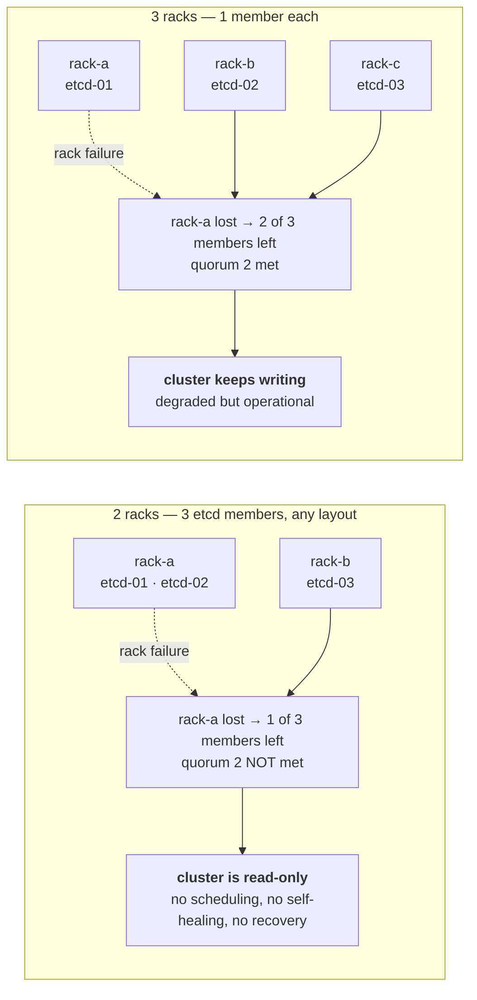

# Overall — 물리적 Rack 위치 구성

모든 솔루션의 고가용성은 **물리 배치가 뒷받침될 때만** 성립합니다. 파드를 3개로 늘려도 세 개가 같은 랙에 있으면 실질 복제본은 1개입니다.
> **English :** High availability only holds if the physical placement backs it up. Three replicas that all live in one rack are, in failure terms, one replica.

공통 랙에 모든 인그레스 트래픽이 몰리거나 이미지 레지스트리가 위치하면 그 랙의 문제가 전체 장애로 이어집니다.
> **English :** If all ingress traffic funnels through one rack, or the image registry sits in one rack, a problem in that rack becomes a cluster-wide outage.

## The number that decides everything — etcd quorum vs rack count

N 멤버 etcd의 쿼럼은 `floor(N/2)+1` 입니다. 따라서 **한 랙에 놓을 수 있는 최대 멤버 수는 `N - quorum`** 입니다.
> **English :** Quorum for an N-member etcd cluster is `floor(N/2)+1`. Therefore the maximum members you may place in a single rack is `N - quorum`.

|etcd 멤버(members)|쿼럼(quorum)|랙당 최대(max per rack)|필요 최소 랙 수(min racks)|가능한 배치(valid layout)|
|--|--|--|--|--|
|3|2|1|**3**|1 / 1 / 1|
|5|3|2|**3**|2 / 2 / 1|
|7|4|3|**3**|3 / 3 / 1|

즉 **홀수 etcd 구성에서 랙 2개로는 어떤 배치를 해도 랙 하나를 잃으면 쿼럼이 깨집니다.** 멤버 수를 늘려도 해결되지 않습니다.
> **English :** With an odd-sized etcd cluster, **no placement across only two racks survives the loss of a rack.** Adding more members does not fix it — three failure domains is the floor, always.



랙이 2개뿐이라면 선택지는 둘입니다. ①랙 장애를 스냅샷 복원 이벤트로 감수하고 SLA에 명시한다 ②세 번째 장애 도메인을 만든다.
> **English :** With only two racks you either accept rack loss as a restore-from-snapshot event and say so in the SLA, or you create a third failure domain.

## A different rack is not always a different failure domain

랙이 달라도 아래가 같으면 같은 장애 도메인입니다.
> **English :** Different racks are not different failure domains if they share any of the following:

- **전원 계통(PDU)** — 랙 2개가 같은 PDU를 물고 있으면 도메인은 1개 / a shared PDU collapses two racks into one domain
- **ToR 스위치 쌍** — 랙 간 연결이 단일 스위치를 경유하면 그 스위치가 SPOF / a single ToR in the path is the SPOF
- **상단 업링크** — 두 ToR이 같은 코어 1대로만 올라가면 마찬가지 / same for a single core uplink
- **냉방 구역** — 같은 항온항습 구역은 함께 죽습니다 / a shared cooling zone fails together

이 저장소는 `pdu`를 인벤토리에 따로 받고, etcd의 PDU가 1계통이면 경고합니다.
> **English :** This repository takes `pdu` as a separate inventory field and warns when all etcd members share one power feed.

## What must never sit in a single rack

|구성요소(Component)|한 랙에 몰렸을 때의 결과(Consequence of single-rack placement)|
|--|--|
|**etcd**|쿼럼 손실 → **클러스터 전체가 읽기 전용**. 가장 치명적<br>Quorum loss → **the entire cluster goes read-only.** The worst case|
|**인그레스 노드**|클러스터는 살아 있는데 **외부에서 들어올 수 없음**<br>The cluster is healthy but **unreachable from outside**|
|**이그레스 노드**|대외 연동 전면 중단<br>All outbound integration stops|
|**이미지 레지스트리**|신규 파드 기동 불가. 기존 파드는 살아 있어 **장애가 늦게 발견됨**<br>No new pods can start; running pods stay up, so **the failure is discovered late**|
|**control-plane**|API 불가 → 스케줄·복구 작업 자체가 불가능<br>No API → you cannot even perform the recovery|
|**스토리지 복제본**|복제본 3개가 한 랙 → 실질 복제본 1개<br>Three replicas in one rack is one replica|

## From "identified" to "enforced"

파악에서 끝내면 위키 문서가 됩니다. 이 저장소는 4단계로 강제합니다.
**코드화 이후 추가 예정입니다.**
> **English :** Identification alone produces a wiki page. This repository enforces it in four steps.

1. 인벤토리에 노드별 `rack` / `pdu`를 적습니다 / record `rack` and `pdu` per node in the inventory
2. `preflight`가 착수 전에 배치를 **검증하고 실패시킵니다** / `preflight` validates the layout and **fails the run**
3. `node_labels`가 랙을 `topology.kubernetes.io/zone` 라벨로 승격합니다 / `node_labels` promotes the rack to the well-known zone label
4. 인그레스 차트가 그 라벨로 `topologySpreadConstraints`를 겁니다 / the ingress charts spread on that label

```yaml
# inventories/prod/hosts.yml
k8s-etcd-01: {node_ip: 10.10.10.11, rack: rack-a, pdu: pdu-a}
k8s-etcd-02: {node_ip: 10.10.10.12, rack: rack-b, pdu: pdu-b}
k8s-etcd-03: {node_ip: 10.10.10.13, rack: rack-c, pdu: pdu-a}
```

```bash
ansible-playbook playbooks/00-preflight.yml --tags topology
```

배치가 잘못되어 있으면 **구축이 시작되지 않습니다.**
> **English :** A wrong layout stops the build before it starts.

```
etcd 3멤버(쿼럼 2)에서 한 랙에 최대 1개까지만 놓을 수 있는데
실제로는 2개가 한 랙에 있습니다. 현재 배치: {'rack-a': 2, 'rack-b': 1}
→ 그 랙을 잃으면 클러스터 전체가 읽기 전용이 됩니다.
```

## Why `topology.kubernetes.io/zone`, and why `ScheduleAnyway`

랙 전용 커스텀 라벨만 쓰면 스케줄러는 인식하지만 **CSI 볼륨 토폴로지와 일부 차트의 기본 spread 설정은 인식하지 못합니다.** 온프레미스 단일 DC에서는 랙을 `zone`으로 매핑하는 것이 호환성이 가장 좋습니다. 이 저장소는 두 라벨을 모두 붙입니다.
> **English :** A custom rack-only label is invisible to CSI volume topology and to the spread defaults baked into several charts. In a single-DC on-prem environment, mapping rack → `zone` is the pragmatic choice; this repository applies both labels.

`whenUnsatisfiable: DoNotSchedule`은 분산을 강제하지만 **랙 하나가 죽었을 때 남은 랙으로 재스케줄되는 것도 막습니다.** 장애 상황에서 파드가 Pending으로 남는 쪽이 더 나쁜 경우가 많아 기본값은 `ScheduleAnyway`입니다.
> **English :** `DoNotSchedule` enforces the spread but also blocks rescheduling onto the surviving racks when a rack dies. Pods stuck in `Pending` during an outage is usually the worse failure mode, so the default here is `ScheduleAnyway`.

## Stateful components need more than spreading

Harbor를 예로 들면, 파드를 랙에 흩뿌리는 것만으로는 HA가 되지 않습니다. Harbor의 실제 상태는 PostgreSQL · Redis · 오브젝트 스토리지에 있습니다. 이 둘 또한 PG는 CloudNativePG, Redis Sentinel 구성으로 완전한 HA를 확보해야 합니다.
> **English :** Simply spreading Harbor pods across different racks does not make Harbor highly available.
>
>Harbor's actual state resides in PostgreSQL, Redis, and object storage. These components must also be designed for high availability. For example, PostgreSQL can be deployed using CloudNativePG, while Redis can be configured with Redis Sentinel to eliminate single points of failure.
>
>If you use Harbor's bundled PostgreSQL and Redis without additional HA configuration, they can become single points of failure (SPOF).